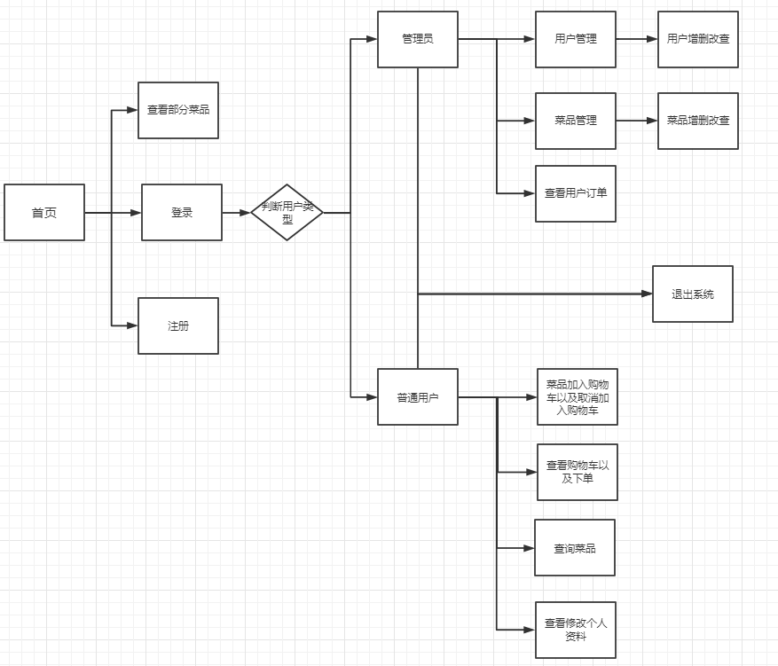
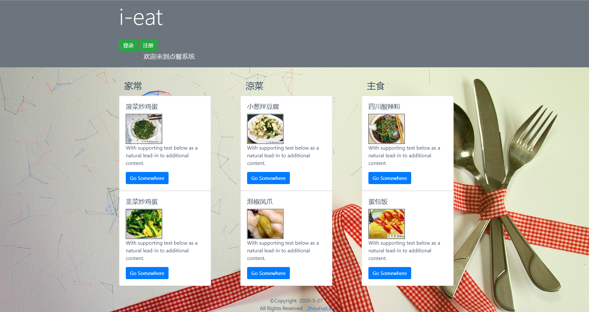

# 网络点餐系统

## :speech_balloon:项目信息

**:sparkles:系统环境**

> 开发环境：Windows

> 开发工具：Eclipse2019-9

> Java版本：JDK13

> 服务：Tomcat9.0

> 数据库：MySQL5.7，Navicate工具

> 系统采用技术： JavaSE+Spring+SpringMVC+JSP+Servlet+Bootstrap

**:building_construction:项目结构**

src-vip-wulinzeng

---controller(控制器)

 ---dao(数据库封装类）

 ---interceptor(拦截器）

 ---model(实体类)

 ---utils(工具类)

sql(数据库文件)

  **功能流程**

### 功能​​

### 功能描述

- 用户在未登录的状态下可以浏览点餐系统中的热点菜品（按点餐率升序排列），今日特价菜品和厨师推荐菜品。

- 用户可以登录点餐系统，如果是新用户则需要先注册再登录。
- 登录后的用户可以按照菜品分类浏览系统中的所有菜品，并可以批量挑选喜爱的菜品加入点餐车。
- 登录后的用户可以查看自己的点餐车浏览所点的菜品，并可以批量删除。
- 登录后的用户可以修改自己的资料。
- 登录后的用户可以退出点餐系统。
- 系统提供一个管理员用户，管理员登录后可以行使管理功能。
- 登录后的管理员可以对用户进行管理，可以浏览所有用户的信息，并对用户进行增加、删除和修改。
- 登录后的管理员可以对菜品分类进行管理，可以浏览所有菜品分类，并对菜品分类进行增加、删除和修改。
- 登录后的管理员可以对菜品进行管理，可以浏览所有菜品的信息，并对菜品进行增加、删除和修改。

### 完成情况

  **基础功能**

- 系统首页（已完善）

- 首页查询菜品信息（已完善）

- 用户（管理员）登录（已完善）

- 用户注册（已完善）

- 用户（管理员）首页（已完善）

- 管理员退出系统（已完善）

- 管理员查看所以用户订单

  **管理员管理用户功能**

- 管理员查询用户（已完善）

- 管理删除用户 （已完善）

- 管理员修改用户（已完善）

- 管理员增加用户（已完善）

  **管理员管理菜品功能**

- 管理员查询菜品（已完善）

- 管理员增加菜品（已完善）

- 管理员修改菜品（已完善）

- 管理员删除菜品（已完善）

  **管理员管理菜品种类功能**

- 管理员查询菜品分类（已完善）

- 管理员增加菜品分类（已完善）

- 管理员删除菜品分类（已完善）

  **用户功能**

- 用户查询菜品（已完善）

- 修改个人资料（已完善）

- 退出系统（已完善）

- 将菜品加入购物车（已完善）

- 菜品取消加入购物车（已完善）

- 查看购物车订单（已完善）

## :key: 数据库

### ER图

### 数据库物理设计

**user表结构**

|    名     | 数据类型 | 描述                       |
| :-------: | :------: | :------------------------- |
|    id     |   int    | 长度11；主键               |
| username  | varchar  | 长度20                     |
| password  | varchar  | 长度20                     |
|   ident   |   char   | 长度1；0普通用户 ，1管理员 |
| telephone | varchar  | 长度20                     |
|  address  | varchar  | 长度50                     |

**food表结构**

|    名    | 数据类型 | 描述                                                         |
| :------: | :------: | ------------------------------------------------------------ |
|    id    |   int    | 主键；长度11                                                 |
| foodname | varchar  | 长度20                                                       |
| feature  | varchar  | 长度100；允许空值                                            |
| material | varchar  | 长度100；允许空值，默认为“暂无”                              |
|  price   |   int    | 长度11                                                       |
|   type   |   int    | 长度为1                                                      |
| picture  | varchar  | 长度为40；允许空值，默认为空值NULL                           |
|   hits   |   int    | 长度10；默认为0                                              |
| comment  |   int    | 长度11；整数代表特价菜的价格，0代表厨师推荐，-1表示为正常菜品；默认为-1 |

**foodtype表结构**

| 名       | 数据类型 | 描述         |
| -------- | -------- | ------------ |
| id       | int      | 主键，长度11 |
| typename | varchar  | 长度20       |

**diningcar（下单购物车）表结构**

| 名     | 数据类型 | 描述         |
| ------ | -------- | ------------ |
| id     | int      | 主键，长度11 |
| userid | int      | 外键，长度11 |
| foodid | int      | 外键，长度11 |

## :framed_picture: 项目截图

**首页**

